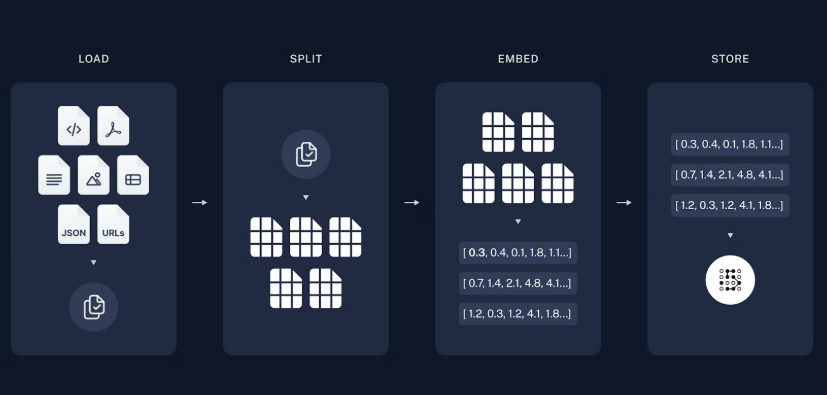
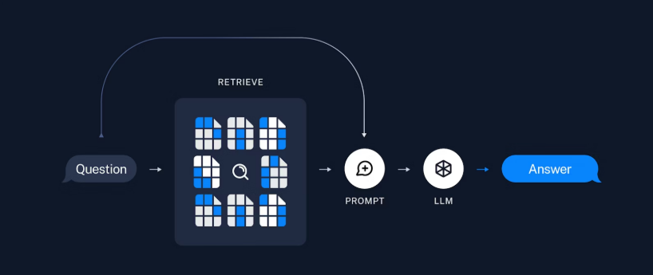

# 🚀 Guía de Implementación: Agente RAG (Retrieval-Augmented Generation)

## Implementación de agente RAG usando LangChain, Next.js y TypeScript

La Generación Aumentada por Recuperación (RAG) permite que los LLMs respondan preguntas sobre información específica de fuentes externas, creando sistemas de Q&A (Preguntas y Respuestas) precisos y actualizados.

---

## 🧠 Conceptos Fundamentales

Para entender RAG, dividimos el proceso en dos grandes etapas:

1. **Indexación**: El proceso de ingesta donde los datos se transforman y preparan para ser consultados.
2. **Recuperación y Generación**: El flujo en tiempo de ejecución que conecta la consulta del usuario con los datos indexados y el modelo de IA.

> [!TIP]
> En esta arquitectura, el **Agente** actúa como el orquestador principal, coordinando los pasos de búsqueda y respuesta de forma inteligente.

---

## 🛠️ Componentes del Ecosistema

| Componente       | Función Principal                                                                      |
|:---------------- |:-------------------------------------------------------------------------------------- |
| **Model (LLM)**  | El "cerebro" que procesa lenguaje natural y genera respuestas coherentes.              |
| **Embeddings**   | Representaciones numéricas (vectores) que capturan el significado semántico del texto. |
| **Vector Store** | Base de datos especializada en buscar similitudes entre vectores de alta eficiencia.   |

---

## 🔄 El Proceso RAG: Paso a Paso

### 1. Fase de Indexación (Preparación)

Antes de preguntar, debemos preparar la base de conocimientos:

* **📥 Load (Carga):** Importación de datos desde fuentes externas (Web, PDFs, bases de datos).
* **✂️ Split (Fragmentación):** División de documentos extensos en *chunks* más pequeños para optimizar la ventana de contexto del modelo.
* **💾 Store (Almacenamiento):** Conversión de fragmentos a vectores e indexación en el *Vector Store*.

---

### 2. Fase de Recuperación y Generación (Ejecución)

Cuando el usuario realiza una consulta, el sistema entra en acción:

* **🔍 Retrieve (Recuperación):** Se buscan los fragmentos más similares a la consulta dentro del *Vector Store*.
* **✍️ Generate (Generación):** El modelo recibe la consulta original + los fragmentos recuperados como contexto para redactar la respuesta final.

---

> [!IMPORTANT]
> La calidad de la respuesta final depende directamente de la relevancia del contexto recuperado y la precisión del proceso de fragmentación (*splitting*).
